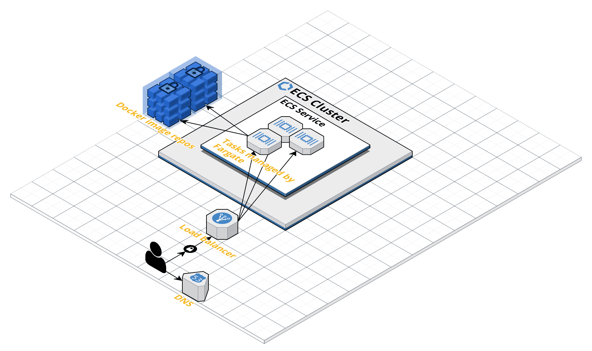

[Figma link](https://www.figma.com/file/oTqNLs8iXiZD5YGkeRTLu8/Get2Gether-Frontend?node-id=0%3A1)

### Things/Tasks to consider before development:

For backend:

-   Set up Husky?
-   Set up Jest and Supertest (for testing node.js HTTP servers)?
-   Set up Swagger docs?
-   Maybe set up a logging library like Winston
-   Best practices for directory structure (routes directory, etc.)
-   What's the best way to collaboratively design database schemas?

For frontend:

-   Set up a state management framework, or just wing it?

### [Temporary] Tasks

-   Set up env variables properly
-   Probably should set up nginx as a reverse proxy in front of the express server: https://stackoverflow.com/questions/63851152/is-nginx-needed-if-express-used#:~:text=You%20will%20need%20Nginx%20(or,application%20framework%20to%20build%20routes.
    -   Might need to set up a multistage Dockerfile to pull in an NGINX server
-   Should also set up nginx for the Next.js frontend
-   Doesn't seem like a good idea to dockerise PostgreSQL and deploy it in a container on ECS. Should probably use a managed service like <a href="https://aws.amazon.com/getting-started/hands-on/create-connect-postgresql-db/">RDS</a> instead

### Setup Instructions

To start, run from the project root directory:

```bash
docker-compose up
```

-   Frontend dev listens on port 3000, Express server listens on port 4000, PostgreSQL server listens on port 5432 (the default)

### Technologies

-   Frontend:
    -   React
    -   Next.js
    -   TypeScript
    -   Tailwind
    -   Postcss
    -   Socket.Io client
    -   Jest & Cypress
-   Backend:
    -   Node.js (TypeScript)
    -   Express
    -   PostgreSQL
    -   Prisma
    -   Socket.Io
    -   Jest

---

### [Temporary] Dev Notes

-   When you change a Dockerfile, `docker-compose` <a href="https://github.com/docker/compose/issues/1487">won't rebuild the image</a>. You need to use the `--build` flag if this causes issues, eg. `docker-compose up --build`

#### Using PostgreSQL:

A PostgreSQL container is started locally (in addition to other containers) when you run `docker-compose up`.

-   To directly interact with the `get2gether` database, use psql to connect to the database server at port 5432.
    ```bash
        psql -h localhost -p 5432 -U get2gether
    ```
    -   Note: PostgreSQL's query engine will automatically lowercase whatever query you write unless you wrap a token in double quotes. Eg. `SELECT * FROM Users` will fail to query the `Users` table because the query is converted to `select * from users` before being executed. Instead, you need to type `SELECT * FROM "Users"`

#### Using Prisma:

-   Use Prisma Migrate to generate and run the SQL for creating tables corresponding to the data models in `schema.primsa` in the database container. Run: `npx prisma migrate dev --name init`
-   When tweaking or adding new data models in `schema.prisma`, it's necessary to manually invoke `prisma generate` to accomodate the changes in the Prisma Client API. See https://www.prisma.io/docs/getting-started/setup-prisma/start-from-scratch/relational-databases/install-prisma-client-typescript-postgres/
    -   Can be automated by making nodemon watch for changes in schema.prisma, but haven't looked into it
-   To write database queries through prisma's query builder, Prisma Client, see https://www.prisma.io/docs/concepts/components/prisma-client
-   Prisma's error handling results in pretty unreadable code :(. Need to match exception code with these error identifiers https://www.prisma.io/docs/reference/api-reference/error-reference

Note: like Prisma, other ORMs like TypeORM and Sequelize all suck ass in their own way

### Production

#### Cloud Architecture (AWS)

View the <a href="https://app.cloudcraft.co/view/5d1e4309-ffa8-4e1c-b1d5-118ebde90b7a?key=4189cfae-0958-4ebb-adba-c19cf7c2a55e">CloudCraft diagram here</a>.



An ECS Fargate cluster manages _tasks_ which are instances of _task definitions_. Task definitions are basically specs for what containers should be run and with what configuration (eg. port mappings, volumes, CPU units, allocated memory, etc.). There is a separate image repository on ECR for the frontend and the backend which the task definition is configured to pull from and deploy onto ECS.

#### Backend:

-   `npx run tsc` to produce production ready files in `build/`, then `npx run start:prod`
